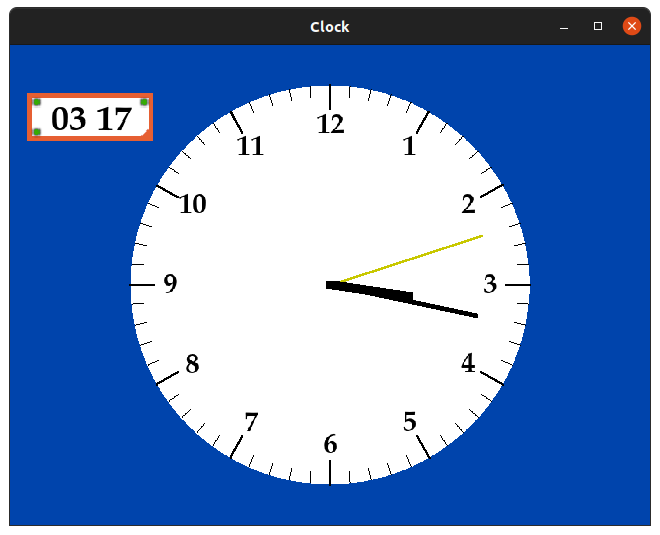
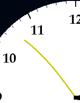
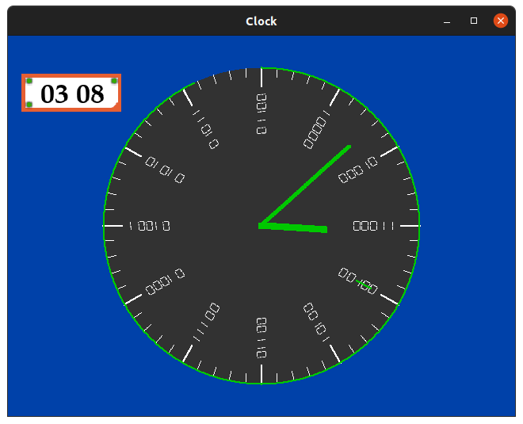
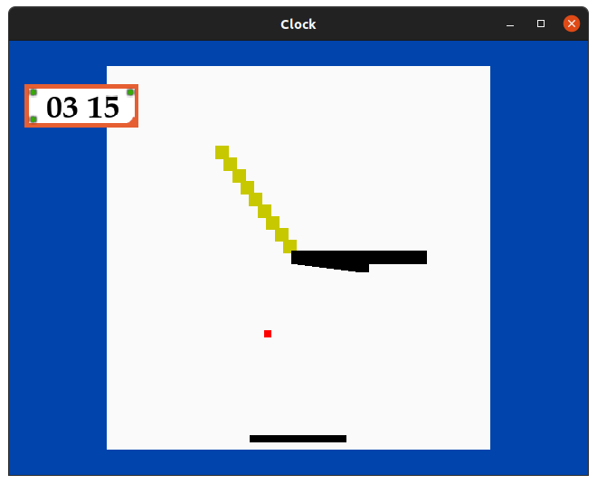

# simple-clock
作成: 鈴木颯太  
C++で実装されたシンプルな時計です．  


## 動作確認済環境
- Cygwin 3.3.3
- i686-pc-cygwin-g++ (GCC) 6.4.0
- Windows 10
- 

## 実行
実行方法です．
1. `make`を実行します．
    - Cygwin環境
        ```
        make
        ```
    - Linux環境
        ```
        make -f Makefile.LINUX
        ```
2. 実行します．
    ```
    ./j18314
    ```

## 機能
本ソフトウェアができることを紹介します．
- ### 起動時アニメーション
    時計が華やかに登場します．後述するエンジニアクロックモードとの切り替えでも再度見ることができます．
- ### 時間による背景色変化
    現実の時間に合った背景色に徐々に変化していきます．窓の外も画面の中も徐々に明るくなっていくのはやめてほしいですね．
- ### しなる針アニメーション
    無機質にカチカチする時計も良いですが，柔らかい素材が使われた時計を見ると，なんだかこっちも柔らかくなりそうですね．  
    
- ### デジタル時計表示
    アナログ時計に慣れていない人もご安心ください．  
    
- ### エンジニアクロックモード
    10進数表記になれていない方もご安心ください．エンジニア向けの「エンジニアクロックモード」があります．矢印キーの`←`または`→`より切り替えることができます．クールなデザインと2進数表記された文字盤があなたを歓迎します．  
    
- ### 可変ウィンドウサイズ
    どのようなサイズで表示されようと，あなたに時刻を知らせるという任務を怠るつもりはありません．
- ### ブロック崩し
    隠し機能として，ブロック崩しがプレイできます．エンジニアクロックモードでない通常の時計が表示されている状態で，`G`を押すとプレイできます．スペースで発射，左右の矢印てバーを操作します．再度`G`を押すと元の画面へ戻ります．  
    

## ライセンス情報
Licenseファイルを参照してください．